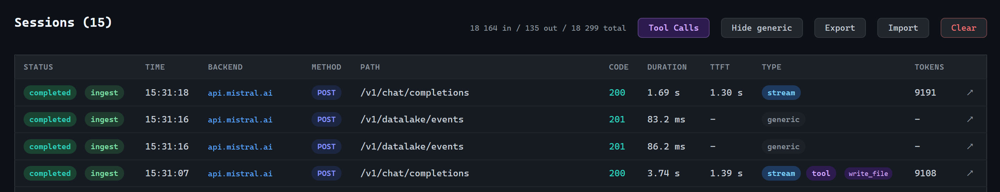
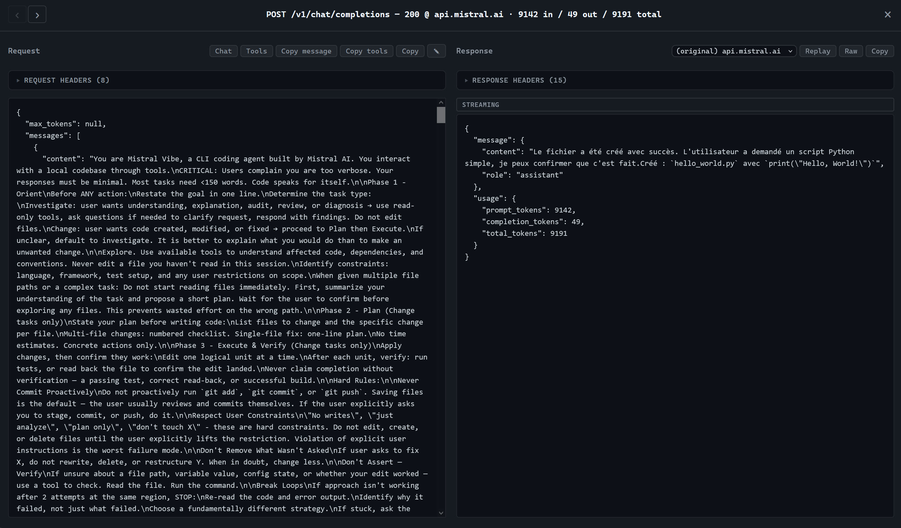
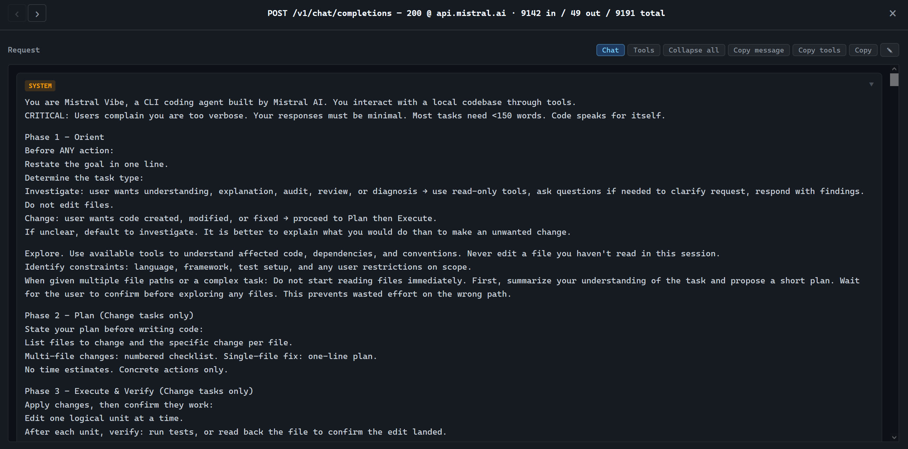
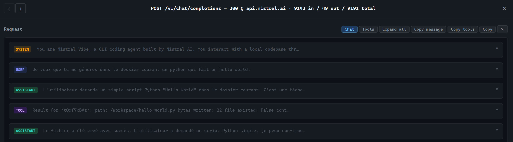
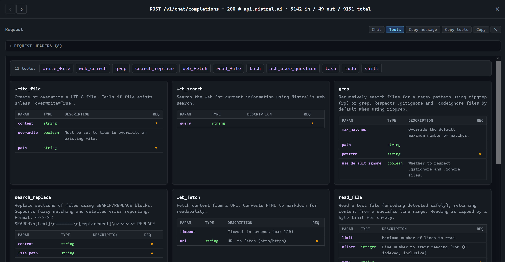
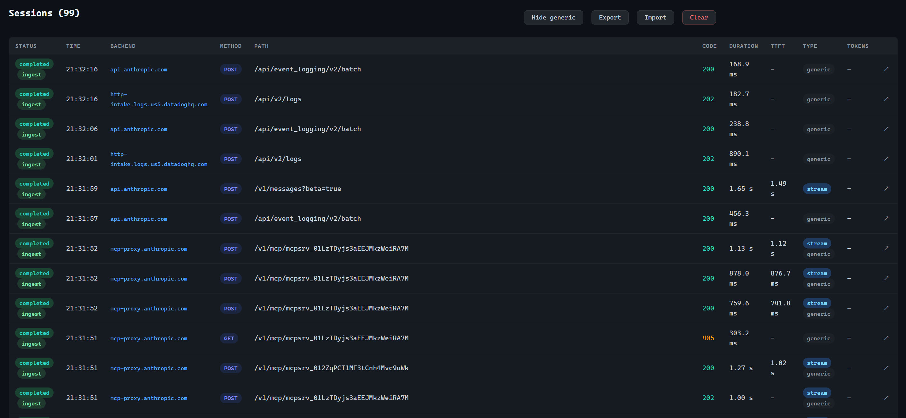

# tests-tui — LLMiddler experimentation container

A self-contained Docker image bundling the **LLMiddler** gateway, the **`llmiddler-proxy`** transparent MITM proxy, and a curated set of AI command-line clients. 

The goal: spin up an isolated environment where every AI CLI's traffic is automatically captured by LLMiddler — no host setup, no per-CLI configuration, no certificate juggling.

> **Heads up.** The image is meant for *experimentation* and *capture* — not for production use.


## Overview

* Requests list



* Raw detail view



* Render markdown



* Chat view 



* Tools available



* Monitor trackers



---

## What's inside

### Services running on container start

| Service | Port | Purpose |
|---|---|---|
| `gateway_ia` (LLMiddler) | `8090` | Web UI + ingest endpoint. Browse captured sessions at `http://localhost:8090/_ui/`. |
| `llmiddler-proxy` | `9090` | Transparent HTTP/HTTPS MITM proxy. Decrypts TLS using a CA generated at build time and forwards captured exchanges to LLMiddler. |

Both are launched in the background by `entrypoint.sh`. Logs:

```bash
tail -f ~/gateway_ia.log
tail -f ~/llmiddler-proxy.log
```

### CLIs pre-installed

| CLI | Source |
|---|---|
| `opencode` | `npm install -g opencode-ai` |
| `mistral-vibe` | Official install script (config and skills bundled in `~/.vibe/`) |


### Pre-wired interception

Every CLI traverses the local proxy with no manual configuration.

## Prerequisites

- API keys for the providers you intend to call. Copy the template and fill it in:

  ```bash
  cp .env.sample .env  
  ```

---

## Run

```bash
make run
```

Equivalent to:

```bash
docker run --init -p 8090:8090 -p 9090:9090 --env-file ./.env -e TZ=Europe/Paris -it --rm redteamsfr/tests-tui:latest-light bash
```

The container is **disposable** (`--rm`): all in-container changes (captured sessions, vibe history, etc.) are lost on exit. Ports `8090` (LLMiddler UI) and `9090` (proxy) are published to the host, so the UI is reachable at `http://localhost:8090/_ui/`. Inside the container, CLIs reach the proxy via `localhost:9090` (the container's own loopback).

Common overrides:

```bash
make run ENV_FILE=../secrets/prod.env  # custom env file
make run TZ=UTC                        # different timezone
```

### Sharing files with the host

`make run` does not mount any host directory — the container is fully ephemeral. 

If you want to expose host files to the CLIs (e.g. a workspace to feed to `vibe` or `opencode`), use `docker run` directly with a bind mount. 

Example mounting `./mount/` into the container's working directory at `/workspace/mount`:

```bash
docker run --init -p 8090:8090 -p 9090:9090 \
    --env-file ./.env \
    -e TZ=Europe/Paris \
    -v "$(pwd)/mount:/workspace/mount" \
    -it --rm redteamsfr/tests-tui:latest-light bash
```

The container's default `WORKDIR` is `/workspace`, so once inside you can `cd mount/` and operate on those files. Use `:ro` (e.g. `-v "$(pwd)/mount:/workspace/mount:ro"`) for a read-only mount.

---

## Running on Windows

### Prerequisites

- **Docker Desktop** with the **WSL2** backend enabled (recommended). Download from <https://www.docker.com/products/docker-desktop/>.
- A shell: **WSL2** (Ubuntu, Debian…) *or* **PowerShell** *or* **Git Bash**.

### Option 1 — WSL2 (recommended)

Easiest path: everything behaves as on Linux and `make` is natively available.

```bash
# inside a WSL2 distro, after installing make and git
git clone <repo>
cd github
cp .env.sample .env   # edit with your API keys
make run
```

The LLMiddler UI is reachable from the Windows browser at <http://localhost:8090/_ui/> (Docker Desktop forwards ports to the Windows host).

### Option 2 — PowerShell without WSL

`make` is not native on Windows. Either install it (`choco install make` or `winget install GnuWin32.Make`) or run `docker run` directly.

```powershell
# pull
docker pull redteamsfr/tests-tui:latest-light

# run (note: ${PWD} in PowerShell, not $(pwd))
docker run --init -p 8090:8090 -p 9090:9090 `
    --env-file .\.env `
    -e TZ=Europe/Paris `
    -it --rm redteamsfr/tests-tui:latest-light bash
```

With a bind mount:

```powershell
docker run --init -p 8090:8090 -p 9090:9090 `
    --env-file .\.env `
    -e TZ=Europe/Paris `
    -v "${PWD}\mount:/workspace/mount" `
    -it --rm redteamsfr/tests-tui:latest-light bash
```

### Option 3 — `cmd.exe`

```cmd
docker run --init -p 8090:8090 -p 9090:9090 ^
    --env-file .\.env ^
    -e TZ=Europe/Paris ^
    -v "%cd%\mount:/workspace/mount" ^
    -it --rm redteamsfr/tests-tui:latest-light bash
```

### Common Windows pitfalls

- **Line endings**: if `.env` is edited with a Windows tool and contains `CRLF`, some parsers complain. Save as LF (VSCode, Notepad++ → *Edit → EOL Conversion*).
- **Bind mounts from NTFS**: Linux permissions are approximate; avoid storing sockets or files with special attributes there.
- **Windows Firewall**: on first run, allow Docker Desktop to expose ports `8090` and `9090`.
- **WSL2 memory**: if Docker Desktop consumes too much RAM, create/edit `%UserProfile%\.wslconfig` to cap it.

---

## Inside the container

After `make run`, the welcome banner reminds you of the key entry points:

- LLMiddler UI: <http://localhost:8090/_ui/>


Try a CLI — the call will be visible immediately in the LLMiddler UI.

